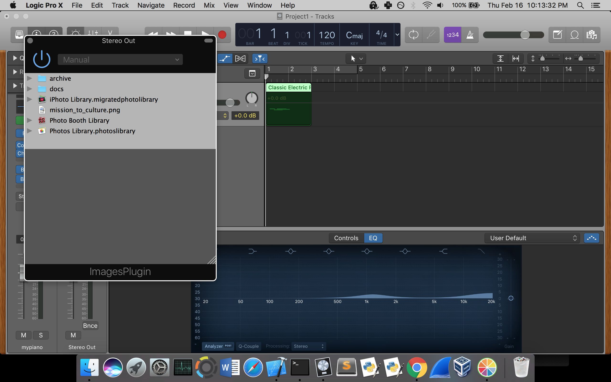
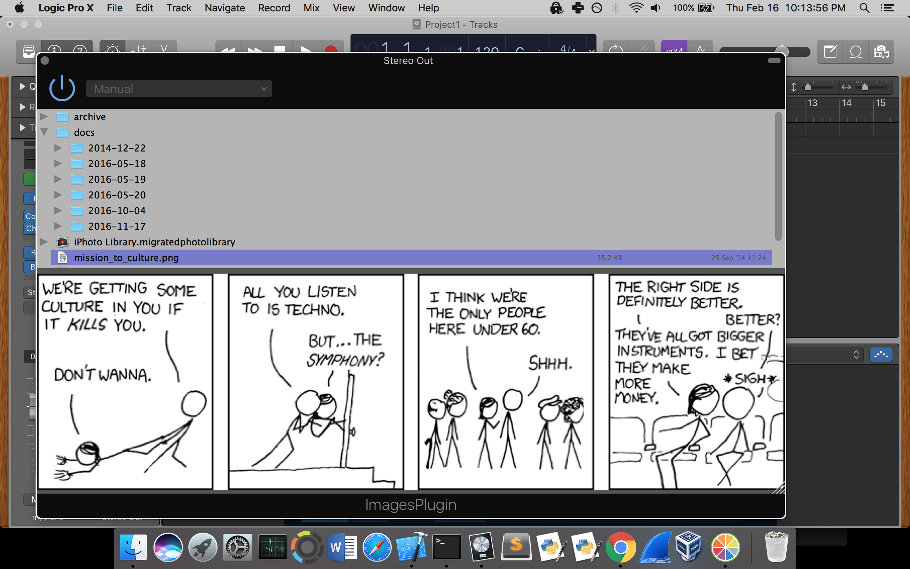
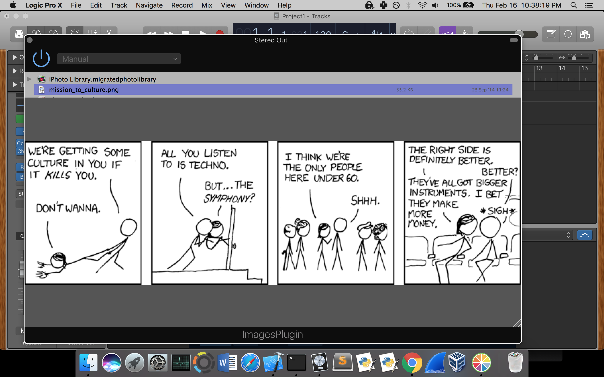

<h1>ImageView</h1>

ImageView is a WIP version of a plugin for Digital Audio Workstations that allows a sound engineer to quickly access pictures stored in a certain directory.
This could be useful when working with analog gear that does not have presets; sound engineers are forced to take pictures of the knob positions in order to restore audio settings.
This is the first version of the plugin that allows you to browse a specified directory, in this case Pictures. It also has a preview window which you can resize and adjust. The plugin gives you an easy access to the folders you have in your Pictures folder, so if you have a folder with images related to a certain DAW project the plugin makes it easy to view those images. 

Written in C++ using JUCE API

<h2>Plugin demo in Logic Pro:</h2>
<h3>Add the plugin:

Choose a picture:

Resizable preview window:

</h3>
